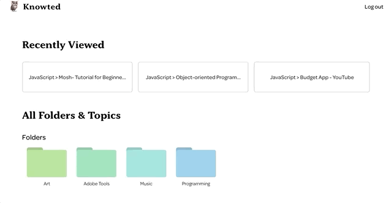

<h1 align=center>Knowted</h1>

    

<h2 align="center"> Learning, optimized. Built with React and Node.
</h2>

---

Looking for the backend? <a href="https://github.com/continuouslylearning/learn-note-backend">Check it out!</a>

## About

Learning from online resources can sometimes feel chaotic. There are so many sites and video tutorials to keep track of and often no real order for what you should focus on next. Not to mention no easy way to keep related notes for what you've learned! Simplify your online learning process with Knowted.

## Contributors

<a href="https://github.com/clkent">
- Chelsea Kent
</a>
 
<a href="https://github.com/jileon">
- Janet Leon
</a>
 
<a href="https://github.com/morgannewman">
- Morgan Newman
</a>
 
<a href="https://github.com/continuouslylearning">
- Timothy Chang
</a>
 
 

## Tech Stack

#### Front-end technologies

React, Redux, Immer, React-Quill, React-Beautiful-DnD, Styled Components, Redux Notifs

#### Server technologies

​Node, Express, Knex, Passport, Cheerio

#### Testing technologies

​Jest, Enzyme, Mocha, Chai

#### Data Persistence

​SQL Database

#### Hosting/SaaS

​​Hosted on Netlify and ElephantSQL

#### Development Environment

Github, TravisCI

## How to Use

This application works best on a desktop browser.

Start by adding the topics you'd like to learn. To create a folder, simply drag and drop two topics together to combine them and name your folder.
 
 
 
 

 

#### Add your own learning resources

Click on a topic to add the resources you want.
Every resource you find for a is stored in it's very own drag and droppable Todo list. Sort your list and then tackle it from the top down.
 
 
 
 

 

#### Easily Take Notes

Click on a topic to add the resources you want.
Every resource you find for a is stored in it's very own drag and droppable Todo list. Sort your list and then tackle it from the top down.
 
 
 
 

